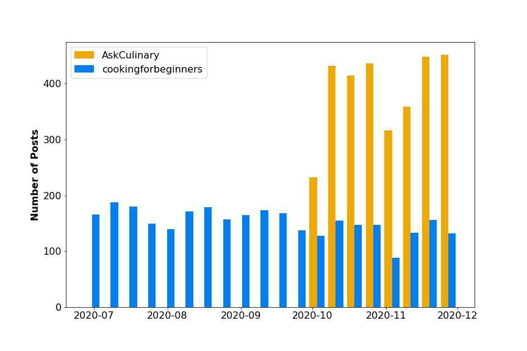

# Project 3 - Web API's and NLP

## Problem Statement

Can I create a model to differentiate r/AskCulinary from r/cookingforbeginners?

## Data
The data used for this model was collected from www.reddit.com. 3100 posts were collected from each subreddit using the pushshift.io API.
It is described in the following data dictionary:

|Feature|Type|Source|Description|
|---|---|---|---|
|author|object| www.reddit.com |User ID of the author| 
|selftext|object| www.reddit.com |Body of the post| 
|title|object| www.reddit.com |Title of the post| 
|created_utc|int| www.reddit.com |Timestamp the post was created| 
|title_word_count|int| www.reddit.com |Number of words in the title| 
|text_word_count|int| www.reddit.com |Number of words in the post| 
|words|object| www.reddit.com |Combined text of the title and selftext| 
|link_flair_text|object| www.reddit.com |Any flair text attached to the post| 
|num_comments|int| www.reddit.com |Number of comments on the post| 
|subreddit|object| www.reddit.com |Subreddit of the post| 
|is_ac|int| www.reddit.com |Binary data for model target| 

## Analysis

I performed a lot of exploratory data analysis on the collected posts before modeling to see if there would be sufficient differences between the two subreddits. The posts had a few notable differences related to the Thanksgiving holiday. Those differences were likely a result of some sampling bias because the posts from AskCulinary were much more heavily concentrated around October and November.
### Post Date

This figure shows the concentration of posts around the Thanksgiving holiday for AskCulinary and is likely problematic. It represents a difference in the data caused by how it was collected instead of something about the data itself.

I created models using default, stemmed, and lemmatized tokens. I gridsearched over Count and TFIDF vectorizers and different ngram ranges. The models used were:

- Logistic Regression
- K Nearest Neighbors
- Random Forest Classifier
- Bagging Classifier
- Support Vector Classifier

## Conclusion and Recommendation

I was able to achieve an accuracy score of 0.715 with a logistic regression model. That is a significant improvement over the baseline model accuracy of 0.503. The best model did not remove stopwords, used TFIDF vectorization and lemmatized tokens. I was hoping for better results but was limited by time and processing power to explore more hyperparameters.

Possible areas to continue include using regular expressions to capture punctuation, specifically '?'. I would also like to compare posts collected with comprable timescales to eliminate the selection bias. Finally looking at the comments would be very interesting. It is possible that the people answering the questions are the same for both, or that the answers are very different based on the subreddit.

## Sources

https://www.reddit.com

http://clipart-library.com/